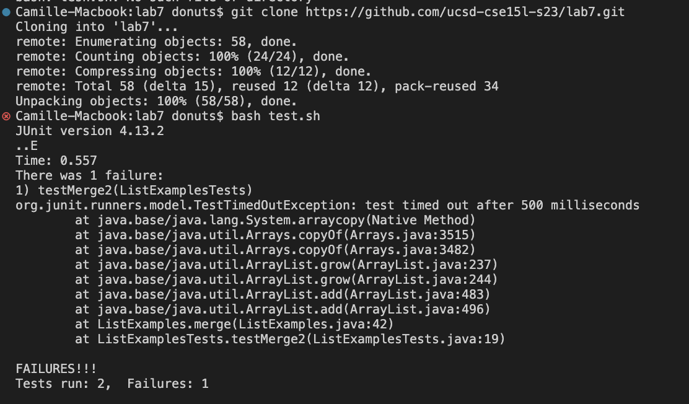
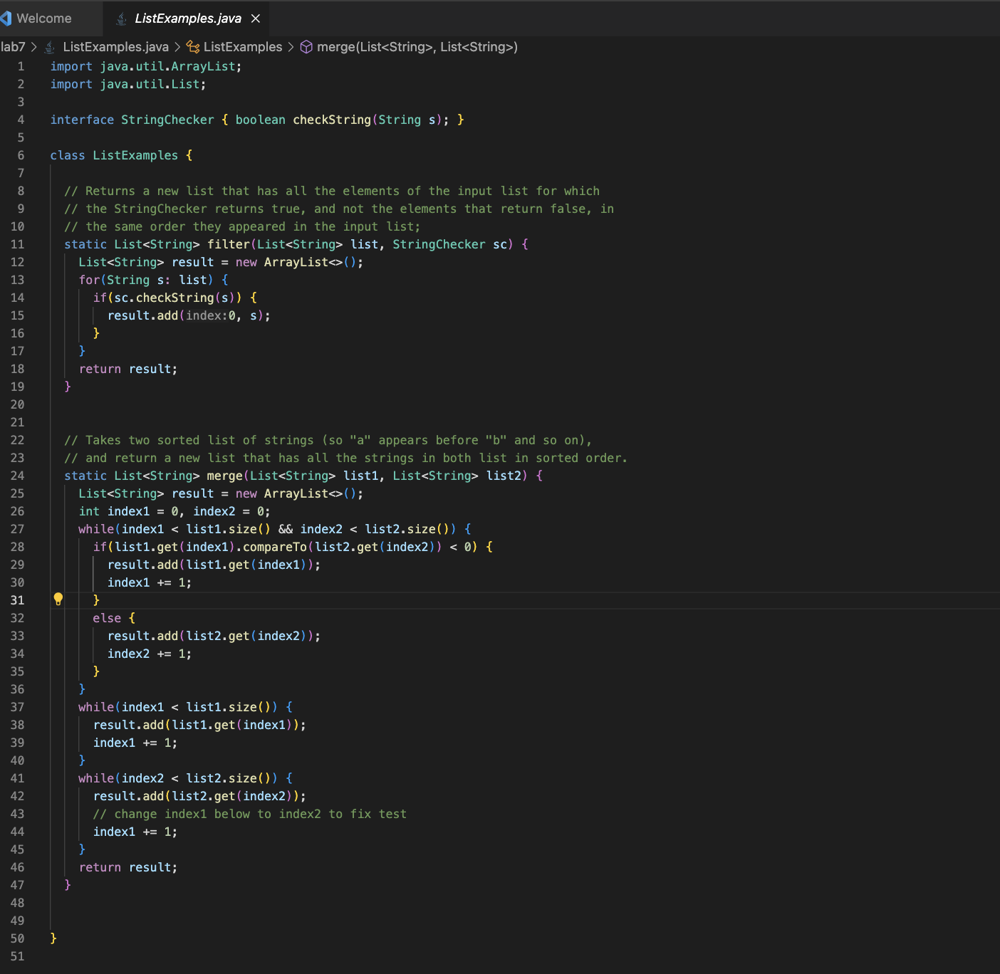
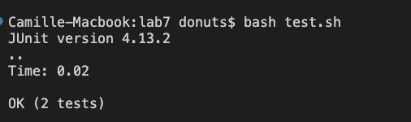

#CSE 15L LAB 5
## Camille Saldajeno
---
### Part 1
**EdStem Post:**

**Student:**

Hi, I've been trying to work on lab 7 for a couple hours now, and I'm not sure how to get rid of the bug. I think the bug might be where it's adding, but I'm not sure which one and how to fix it. I attached screenshots of the symptom, ListExamples.java and ListExamplesTests.java below.

**TA Response:**

Hi, after looking at your screenshots, I definately think you're on the right track. According to the symptom, there seems be an error with your merge method, so Re-check your `ListExamples.java` file, specifically the second while loop where you're adding. Make sure you're using the right variables for counting. Hope this helps!

**Student Fix:**

Thank you so much!!! I was able to fix the bug by changing `index1` to `index2` in the second while loop as you adviced. `index1` caused an infinite loop. index is supposed to traverse list1, but was instead using list2, making the loop unable to progress towards the termination condition, which is `index2 < list2.size()`. `index2` works, given it's association with `list2`

