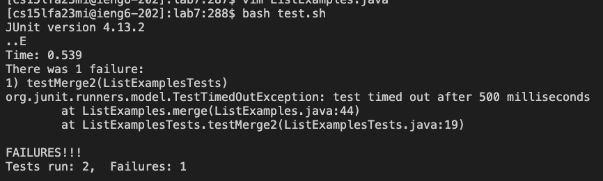
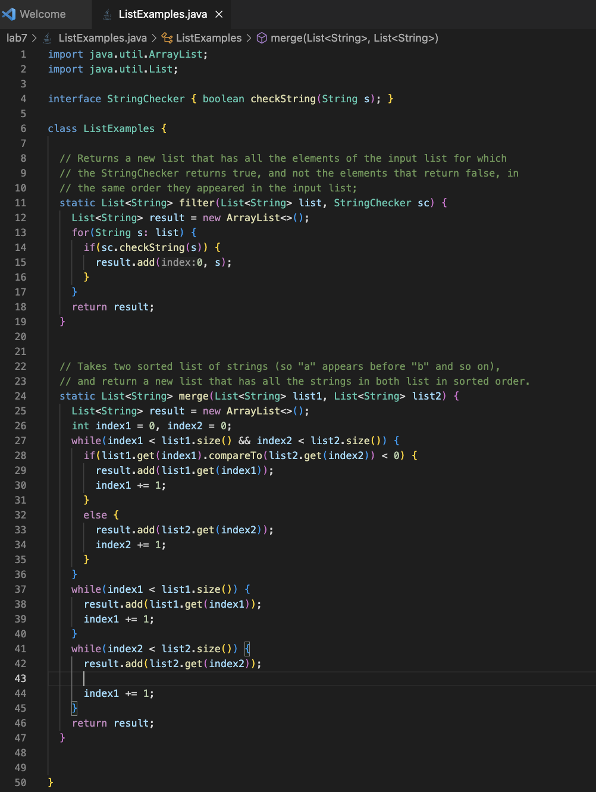
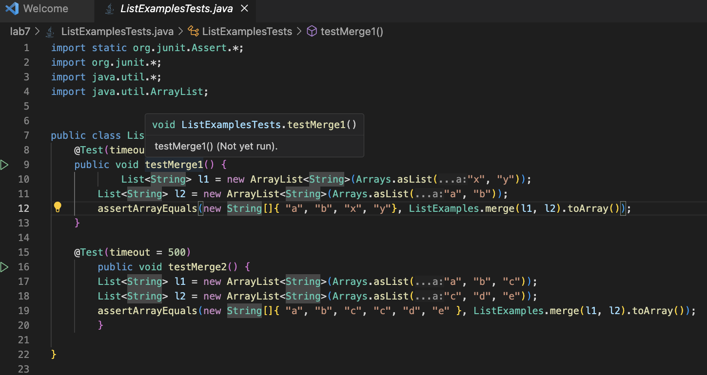
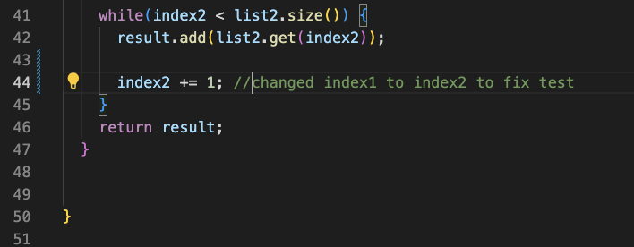
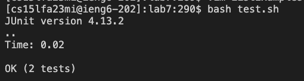
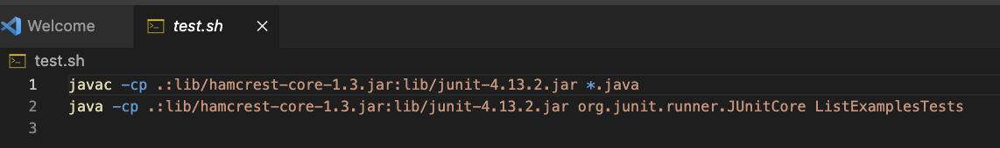

# CSE 15L LAB 5
## Camille Saldajeno
---
### Part 1
**EdStem Post:**

**Student:**

Hi, I've been trying to work on lab 7 for a couple hours now, and I'm not sure how to get rid of the bug. I think the bug might be where it's adding, but I'm not sure which one and how to fix it. I attached screenshots of the symptom, ListExamples.java and ListExamplesTests.java below.





**TA Response:**

Hi, after looking at your screenshots, I definately think you're on the right track. According to the symptom, there seems be an error with your merge method, so re-check your `ListExamples.java` file, specifically the second while loop (lines 41-45) where you're adding. Make sure you're using the right variables for counting. Hope this helps!

**Student Fix:**

Thank you so much!!! I was able to fix the bug by changing `index1` to `index2` in the second while loop as you adviced. `index1` caused an infinite loop, since it is supposed to traverse list1, but was instead using `list2`, making the loop unable to progress towards the termination condition, `index2 < list2.size()`. `index2` works, given it's association with `list2`.




**File & Directory Structure needed:**

- lab7
  - lib
      - hamcrest-core-1.3.jar
      - unit-4.13.2.jar
  - .gitignore
  - ListExamples.java
  - ListExamplesTests.java
  - test.sh
 
**Contents of each file before fixing***
ListExamples.java


ListExamplesTests.java


test.sh


**The full command line (or lines) you ran to trigger the bug**
```
ssh cs15lfa23mi@ieng6.ucsd.edu
git clone https://github.com/ucsd-cse15l-s23/lab7.git
cd lab7
bash test.sh
```
**A description of what to edit to fix the bug**

I changed `index1` in second while loop in the ListExamples.java

```
while(index2 < list2.size()) {
    result.add(list2.get(index2));
    
    index1 += 1;
}
```
to `index2` as seen below:

```
while(index2 < list2.size()) {
    result.add(list2.get(index2));
    
    index2 += 1;
}
```

### Part 2

One learning experience I particularly found interesting in the second half of the quarter is bash scripting for automating repetitive tasks. I liked how it made repetitive and time-consuming tasks more efficient, while reducing manual intervention and overall mistakes. I can see myself using this in the future for projects where automation, scripting, and command-line operations play a significant role.
